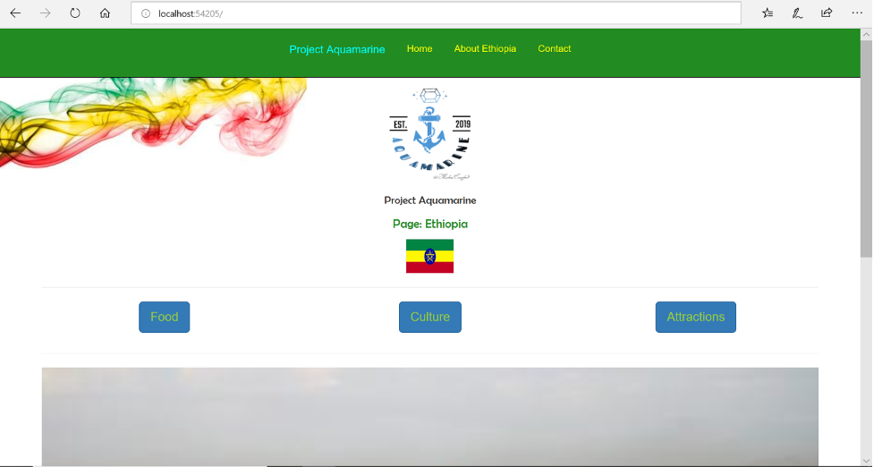
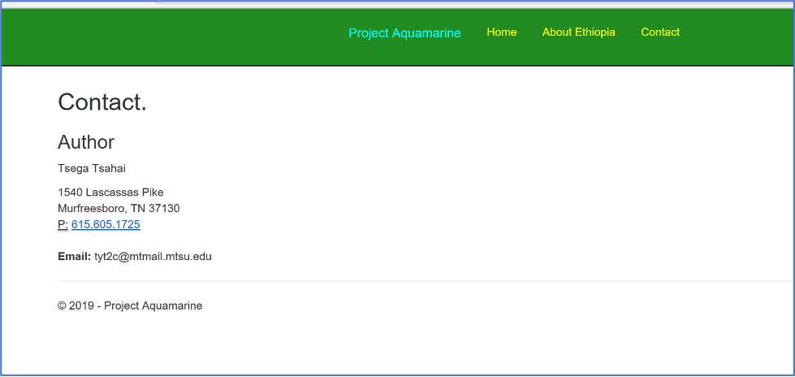
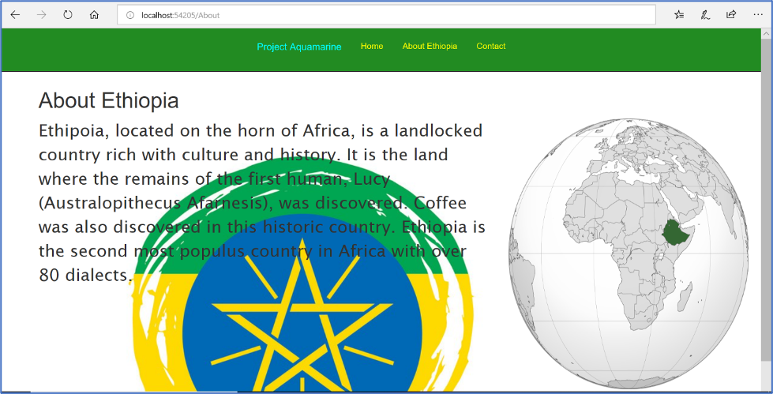
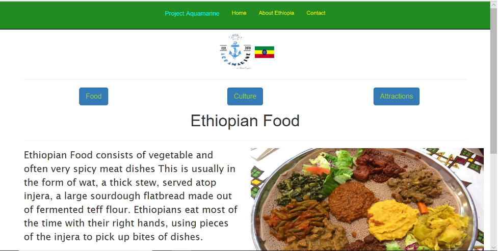
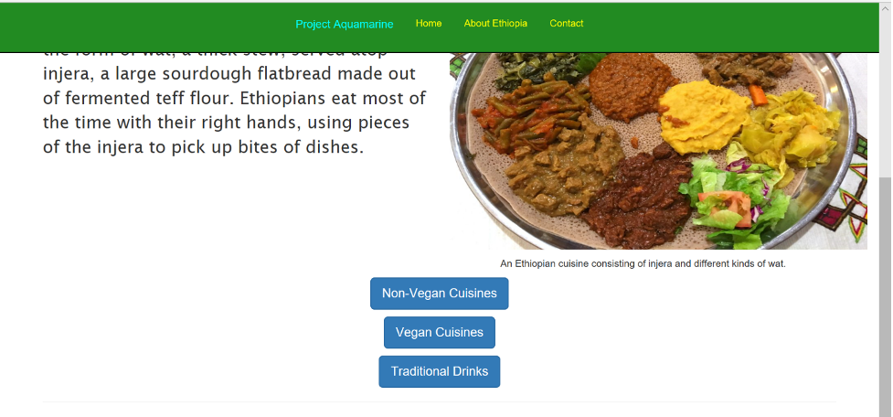
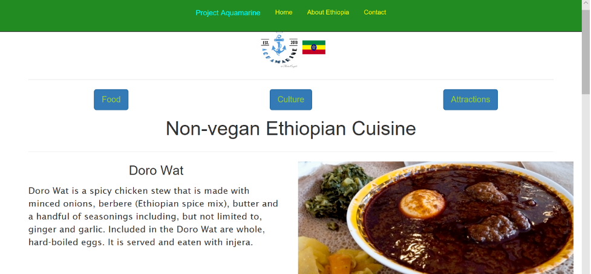
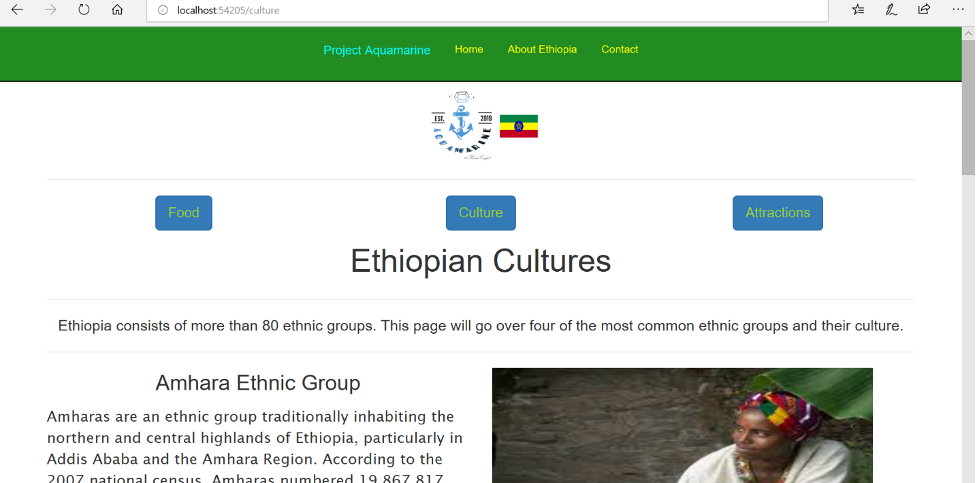
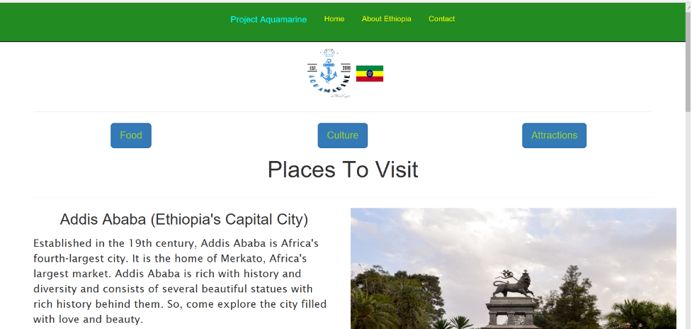

# Project Aquamarine: Ethiopian Page

## User Section

Project Aquamarine is a web application that consists of four sub-applications. These sub-applications let the user learn about different cultures by providing information on the foods, attraction sites and cultures of a specific regions. The Ethiopian page of this project consists of information about Ethiopia, different ethnic groups in Ethiopia, different foods and places to visit while in Ethiopia. The homepage looks like: 

As we can see from the above picture, we have a `Home`, `About Ethiopia` and `Contact` buttons. The Project Aquamarine and *Home* button will always navigate the web application to this page. When the *About Ethiopia* button is clicked, a page with a very brief description of Ethiopia is displayed. When the *Contact* button is clicked, the author’s contact information (address, phone number) is displayed. Like so:

When the `Food` button from the homepage is clicked, the web application will navigate to this page:

As seen in the above picture, the *Food* page consists of information about Ethiopian food with the help of a picture. The bottom of this page looks like:

Here the user has options of choosing *Non-Vegan Cuisines*, *Vegan Cuisines*, or *Traditional Drinks*. For example, when the *Non-Vegan Cuisines* button is clicked, the following page will open: 

This page consists of four of the most famous non-vegan Ethiopian cuisines and their descriptions with the assistance of pictures. The same thing would happen had the user clicked on *Vegan Cuisines* or *Traditional Drinks*.

If the user wanted to navigate to the culture page, they would have to click on the *Culture* button located on top of all the pages. Once it is clicked, the web application will navigate to this page:

Similar to the Food page, the Culture page is filled with information about Ethiopian ethnic groups and their associated cultures along with pictures of their traditional clothings. 

If the user clicks on the *Attractions* button, the web page will navigate to:

This page consists of popular tourism sites in Ethiopia, along with descriptions and pictures of these sites. 

The user has the option of going to any of the pages from any screen as all the buttons are visible in every page. 

## Technical Section

This web application was built using the Microsoft .NET Framework 4.6 which includes ASP.NET Web Forms. The ASP.NET Web Forms is part of the ASP.NET web applications. Visual Studios was used to create this Web Form. The Visual Studio Integrated Development Environment (IDE) lets the programmer drag and drop server controls to lay out the Web Forms pages. 

Languages used to build this application include `C#` and `HTML5`. C# was used to write server code to handle logic for the pages while HTML was used to write the page. The Bootstrap Library was also included. 

